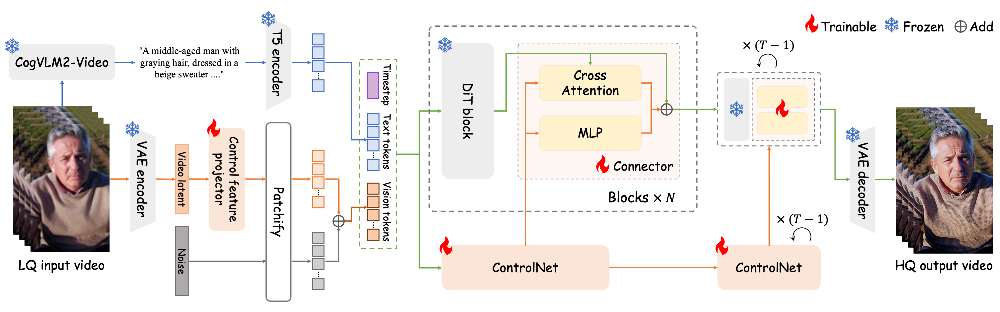

<div align="center">

<h1>
    Vivid-VR:<br> 
    Distilling Concepts from Diffusion Transformer for Photorealistic Video Restoration
</h1>

<div>
    <a href='https://csbhr.github.io/' target='_blank'>Haoran Bai</a>&emsp;
    <a href='#' target='_blank'>Xiaoxu Chen</a>&emsp;
    <a href='#' target='_blank'>Canqian Yang</a>&emsp;
    <a href='#' target='_blank'>Zongyao He</a>&emsp;
    <a href='#' target='_blank'>Sibin Deng</a>&emsp;
    <a href='https://scholar.google.com/citations?user=NpTmcKEAAAAJ&hl=en' target='_blank'>Ying Chen<sup>∗</sup></a>
</div>
<div>
    Alibaba Group - Taobao & Tmall Group
</div>
<div>
    * Corresponding author
</div>

<strong>
<a href='#' target='_blank'>Paper (<txt style='color:red;'>Coming soon!</txt>)</a> | 
<a href='https://csbhr.github.io/projects/vivid-vr/' target='_blank'>Project Page</a>
</strong>

<br>
<br>  

<div style="width: 100%; text-align: center; margin:auto;">
    
</div>

For more visual results, go checkout our <a href="https://csbhr.github.io/projects/vivid-vr/" target="_blank">[project page]</a>

---
</div>


## 🔥 Update
- [2025.08.01] UGC50 and AIGC datasets are made publicly available from [[link]](https://github.com/csbhr/Vivid-VR/testsets/).
- [2025.08.01] Inference code is released.
- [2025.08.01] This repo is created.

## 🎬 Overview


## 🔧 Dependencies and Installation
1. Clone Repo
    ```bash
    git clone https://github.com/csbhr/Vivid-VR.git
    cd Vivid-VR
    ```

2. Create Conda Environment and Install Dependencies
    ```bash
    # create new conda env
    conda create -n Vivid-VR python=3.10
    conda activate Vivid-VR

    # install pytorch
    pip install torch==2.2.1 torchvision==0.17.1 torchaudio==2.2.1 --index-url https://download.pytorch.org/whl/cu121

    # install python dependencies
    pip install -r requirements.txt
    ```

3. Download Models

   - Download CogVideoX1.5-5B checkpoints from [[link]](https://huggingface.co/zai-org/CogVideoX1.5-5B).
   - Download cogvlm2-llama3-caption checkpoints from [[link]](https://huggingface.co/zai-org/cogvlm2-llama3-caption).
   - Download Vivid-VR checkpoints from [[link]](#).
   - Put them under the `./ckpts` folder.

   The [`ckpts`](./ckpts) directory structure should be arranged as:

    ```
    ├── ckpts
    │   ├── CogVideoX1.5-5B
    │   │   ├── ...
    │   ├── cogvlm2-llama3-caption
    │   │   ├── ...
    │   ├── Vivid-VR
    │   │   ├── controlnet
    │   │       ├── config.json
    │   │       ├── diffusion_pytorch_model.safetensors
    │   ├── RealESRGAN
    │   │   ├── RealESRGAN_x2plus.pth
    │   ├── easyocr
    │   │   ├── model
    │   │       ├── english_g2.pth
    │   │       ├── zh_sim_g2.pth
    │   │   ├── craft_mlt_25k.pth
    │   │   ├── zh_sim_g2.pth
    ```


## ☕️ Quick Inference

Run the following commands to try it out:

```shell
python VRDiT/inference.py \
    --ckpt_dir=./ckpts \
    --cogvideox_ckpt_path=./ckpts/CogVideoX1.5-5B \
    --cogvlm2_ckpt_path=./ckpts/cogvlm2-llama3-caption \
    --input_dir=/dir/to/input/videos \
    --output_dir=/dir/to/output/videos \
    --upscale=0 \  # if set to 0, the short-size of output videos will be 1024
    --textfix \  # if given, the text region will be replaced by the output of Real-ESRGAN
    --save_images  # if given, the video frames will be saved

```


## 📑 Citation

   If you find our repo useful for your research, please consider citing it:

   ```bibtex
   @misc{bai2025vividvr,
      title={Vivid-VR: Distilling Concepts from Diffusion Transformer for Photorealistic Video Restoration}, 
      author={Haoran Bai and Xiaoxu Chen and Canqian Yang and Zongyao He and Sibin Deng and Ying Chen},
      year={2025},
      url={https://github.com/csbhr/Vivid-VR}
    }
   ```

